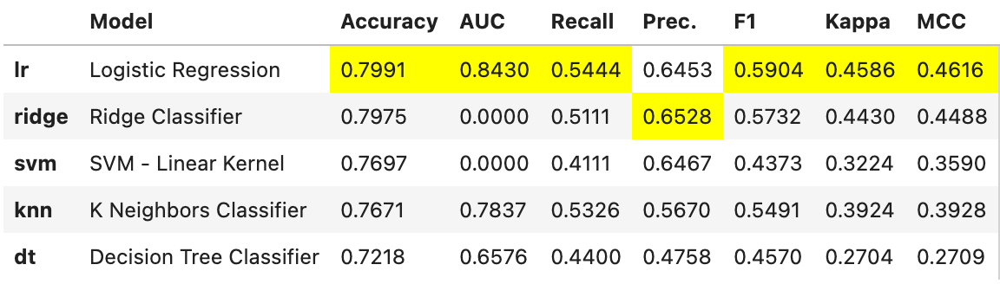
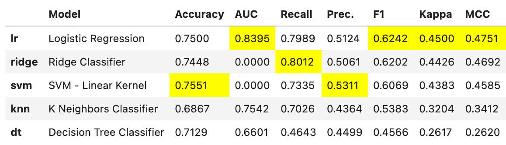

# Predict churn of customers

*This is a capstone project made for the Udacity's Data Scientist Nanodegree program.*

## Introduction

### What is churn?

Churn is the phenomenon where customers stop using your product. It is often presented as a metric that quantifies how many people have stopped using your service over a specific time period. This kind of analysis is important as it helps you find indicators of lower engagement and spot the people who may leave. Using such insights you can improve your service and offers which will lead to better user retention.

### Dataset

The *Telco customer churn* data contains information about a fictional telecommunications company that provided home phone and Internet services.

Source: [Kaggle](https://www.kaggle.com/blastchar/telco-customer-churn)

Each row represents a customer, each column contains customer’s attributes.

The data set includes information about:

* Customers who left within the last month – the column is called Churn
* Services that each customer has signed up for – phone, multiple lines, internet, online security, online backup, device protection, tech support, and streaming TV and movies
* Customer account information – how long they’ve been a customer, contract, payment method, paperless billing, monthly charges, and total charges
* Demographic info about customers – gender, age range, and if they have partners and dependents

### The aim of this project

1. Do exploratory data analysis of the dataset.
2. Build a binary classification model that will predict customer churn.
3. Build a web application that will allow to make predictions based on entered data.

### Evaluation metrics

To evaluate the model we should choose metrics that are relevant to the problem and the dataset.

*Accuracy* is not a good metric to use in our case, because the target feature (`churn`) is not balanced throughout the dataset - 26.5% of customers are labeled as churned and 73.5% are not. This means that if we label all the customers as not churning, then we will have 73% accuracy - even though this number looks impressive, the model is useless.

In our problem we want to detected as many customers who may churn as possible, so that we can act and prevent it. But on the other hand, we do not want to bother too many customers who do not plan to leave our service. Hence, we need to find a model with good balance between *precision* and *recall*, and also optimise the model for these metrics. The *F-score* is a way of combining the precision and recall of the model, and it is defined as the harmonic mean of the model’s precision and recall. Later, the *F-score* will be used to compare models and choosing the best one.

### Project's file structure

TBD: poprawić strukturę plików

```
- app
| - template
| |- master.html  # main page of web app
| |- go.html  # classification result page of web app
|- run.py  # Flask file that runs app

- data
|- WA_Fn-UseC_-Telco-Customer-Churn  # data to process
|- transformed.csv  # transformed data used to build the model

- notebooks
|- eda.ipynb  # Containts exploratory data analysis
|- model.ipynb  # Contains analysis of ML models

- model
|- train_classifier.py  # script that creates the ML model
|- classifier.pkl  # saved model

- README.md
- requirements.txt
- environment.yaml
```

## Exploratory data analysis (EDA)

The detailed EDA is available in the `eda.ipynb` notebook.

As a result of the EDA, the following set of features was chosen to build the model:
* Gender: The customer’s gender: Male, Female
* Senior Citizen: Indicates if the customer is 65 or older: Yes, No
* Partner: Indicates if the customer is a partner: Yes, No
* Dependents: Indicates if the customer lives with any dependents: Yes, No. Dependents could be children, parents, grandparents, etc.
* Phone Service: Indicates if the customer subscribes to home phone service with the company: Yes, No
* Internet Service: Indicates if the customer subscribes to Internet service with the company: No, DSL, Fiber Optic, Cable.
* Online Security: Indicates if the customer subscribes to an additional online security service provided by the company: Yes, No
* Online Backup: Indicates if the customer subscribes to an additional online backup service provided by the company: Yes, No
* Device Protection Plan: Indicates if the customer subscribes to an additional device protection plan for their Internet equipment provided by the company: Yes, No
* Tech Support: Indicates if the customer subscribes to an additional technical support plan from the company with reduced wait times: Yes, No
* Streaming TV: Indicates if the customer uses their Internet service to stream television programing from a third party provider: Yes, No. The company does not charge an additional fee for this service
* Streaming Movies: Indicates if the customer uses their Internet service to stream movies from a third party provider: Yes, No. The company does not charge an additional fee for this service
* Contract: Indicates the customer’s current contract type: Month-to-Month, One Year, Two Year
* Paperless Billing: Indicates if the customer has chosen paperless billing: Yes, No
* Payment Method: Indicates how the customer pays their bill: Bank Withdrawal, Credit Card, Mailed Check
* Tenure Buckets: Indicates the range in which the customer's tenure value is, it is denoted in months: 0-20, 21-50, 50+
* Monthly Charges Buckets: Indicates a range in which the customer’s current total monthly charge is for all their services from the company: 0-40, 41-60, 60+
* Multiple Lines Buckets: Indicates if the customer subscribes to multiple telephone lines with the company: Yes; either has one line or not at all: Other
* Num Internet Services: Indicates the total number of additional internet services the customer has: 0 - 6
* Churn: Indicates if the customer have churned: Yes, No

## Model

In training all the models, the 5-fold cross-validation is used. We do not need to perform any imputation method, as no missing values occure in this datasest.

### Initial results

With basic setup the results looked as follows:



### Improving the setup

After testing some tweaks, I ended with the following configuration:
* the feature `NumInternetServices` is chosen to be numerical, the rest is categorical,
* the numeric feature is normalized, the `z-score` normalization is used,
* SMOTE method is used to fix the imbalance.

And here are the results:



We see that the later setup improved the F1 score for the top three models.

### Tuning models

The detailed analysis of the tuning results is available in the `model.ipynb` notebook.

Here are the results obtained when validating the models.

**Logistic regression**

```md
+---------------+------------+----------+-------------+------+
|               |   Accuracy |   Recall |   Precision |   F1 |
+===============+============+==========+=============+======+
| Model Summary |      0.743 |    0.731 |       0.509 |0.600 |
+---------------+------------+----------+-------------+------+
```

**Ridge classifier**

```md
+---------------+------------+----------+-------------+-------+
|               |   Accuracy |   Recall |   Precision |    F1 |
+===============+============+==========+=============+=======+
| Model Summary |      0.746 |    0.742 |       0.513 | 0.607 |
+---------------+------------+----------+-------------+-------+
```

**Linear SVM**

```md
+---------------+------------+----------+-------------+-------+
|               |   Accuracy |   Recall |   Precision |    F1 |
+===============+============+==========+=============+=======+
| Model Summary |      0.709 |    0.753 |       0.468 | 0.577 |
+---------------+------------+----------+-------------+-------+
```

**KNN classifier**

```md
+---------------+------------+----------+-------------+-------+
|               |   Accuracy |   Recall |   Precision |    F1 |
+===============+============+==========+=============+=======+
| Model Summary |      0.733 |    0.694 |       0.496 | 0.578 |
+---------------+------------+----------+-------------+-------+
```

**Decision tree**

```md
+---------------+------------+----------+-------------+-------+
|               |   Accuracy |   Recall |   Precision |    F1 |
+===============+============+==========+=============+=======+
| Model Summary |      0.722 |    0.613 |       0.479 | 0.538 |
+---------------+------------+----------+-------------+-------+
```

The logistic regression and the Ridge classifier give similar best results. I choose the logistic regression as the final model for the problem.


### The final model

Here are the statistics describing the linear regression model which was trained using the entire train+test dataset and validated on unseed data:

```md
+---------------+------------+----------+-------------+-------+
|               |   Accuracy |   Recall |   Precision |    F1 |
+===============+============+==========+=============+=======+
| Model Summary |      0.760 |    0.812 |       0.517 | 0.632 |
+---------------+------------+----------+-------------+-------+
```

The visualisation of the class prediction error, where `1` means *churned* and `0` means *not churned*.


The visualisation of the cofusion matrix.


The top 10 features according to their importance.


We can conclude that churn is mostly determined by the following characteristics of
the customer:
* has 2-year or month-to-month contract,
* has short tenure,
* uses the fiber optic.

## Web app

IN PROGRESS

## How to run it

**To run this project the [conda](https://docs.conda.io/en/latest/) package and environment manager is being used.**

### Creating the conda environment

Libraries and their versions required for replication of this analysis are listed in the `requirements.txt` file.

Python version: 3.8.12

Run `conda create --name <env> --file requirements.txt` to create a conda environment, and then `conda activate <env>` to activate it.

### Notebooks

Navigate to the projekt's main directory and run `jupyter lab`, then you can open the notebooks from within this lab environment.

### Pipelines

Go to the projekt's main directory.

Use the following command to run the *data processing pipeline*:

```bash
python data_processing/process_data.py data/WA_Fn-UseC_-Telco-Customer-Churn.csv data/customers.db
```

as a result, you will obtain a transformed dataset which is saved in an SQL database `customers.db`.

Use the following command to run the *machine learning pipeline*:

```bash
python modelling/train_classifier.py data/customers.db models/linear_reg.pkl
```

as a result, you will obtain a machine learning pipeline which is saved as a
`linear_reg.pkl` file.

### Web App

IN PROGRESS
