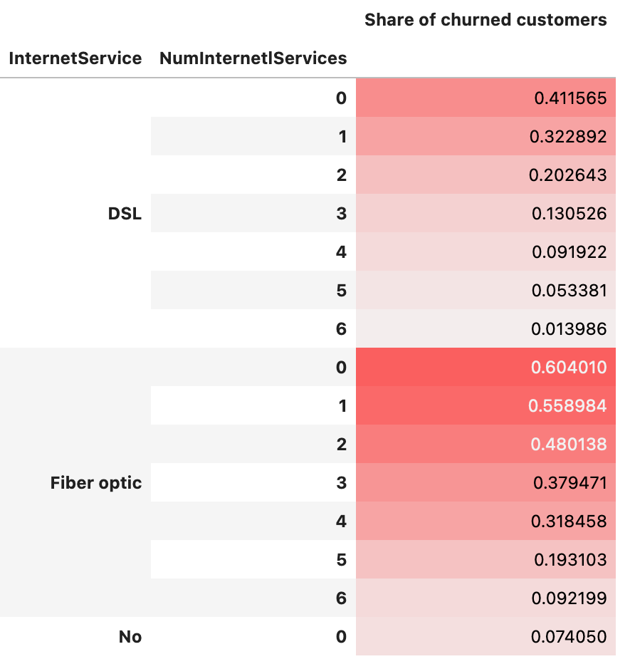
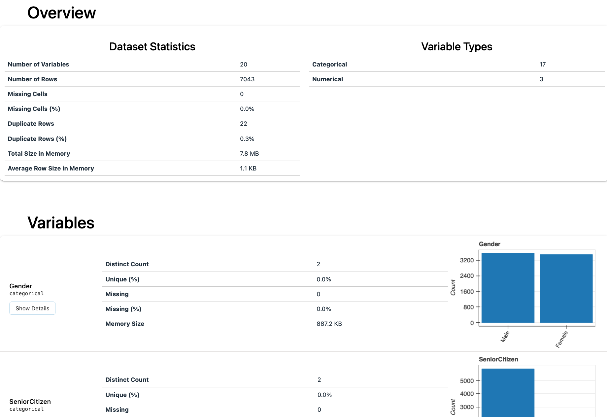
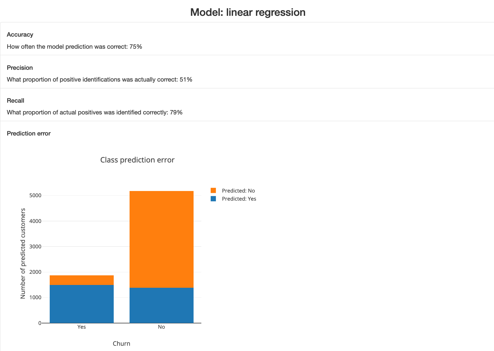

# Predict churn of customers

*This is a capstone project made for the Udacity's Data Scientist Nanodegree program.*

## Writeup

### Project overview

Churn is the phenomenon where customers stop using your product. It is widely known in business that it it easier to keep an existing customer than to gain a new one. Similarly, it is also easier to save a customer before they leave than to convince them to come back. Hence, understanding and preventing customer churn is a crucial task and every business should allocate some part of their resources to work on it. Customer churn analysis helps in finding indicators of churn. Using such insights you can improve your service and offers which will lead to better user retention.

In this project I will take on a role of a data scientist that works for Telco, which is a fictional telecommunications company that provides home phone and Internet services. I am provided with a dataset of current and former customers, that contains information about:

* Customers who left within the last month – the column is called Churn
* Services that each customer has signed up for – phone, multiple lines, internet, online security, online backup, device protection, tech support, and streaming TV and movies
* Customer account information – how long they’ve been a customer, contract, payment method, paperless billing, monthly charges, and total charges
* Demographic info about customers – gender, age range, and if they have partners and dependents

Source of the data: [Kaggle](https://www.kaggle.com/blastchar/telco-customer-churn)

### Problem statement

In order to help the company in retaining the customers I need to:

1. Build a binary classification model that will predict which customers may churn. - Such model can be used for example to predict what will happen in the near future. Knowing what churn we expect to see will help in building business strategy.
2. Build a web application that will allow to make predictions based on entered data. - One data scientist is a bottleneck when there are many stakeholders who need data. Such an application will be helpful for example for the team who works closely with individual customers. When they know the probability of churn of a given customer, they may act accordingly and customize the offer.

### Evaluation metrics

To evaluate the model we should choose metrics that are relevant to the problem and the dataset.

*Accuracy* is not a good metric to use in our case, because the target feature (`churn`) is not balanced throughout the dataset - 26.5% of customers are labeled as churned and 73.5% are not. This means that if we label all the customers as not churning, then we will have 73% accuracy - even though this number looks impressive, the model is useless.

In our problem we want to detected as many customers who may churn as possible, so that we can act and prevent it (that is *precision*). On the other hand, we do not want to bother too many customers who do not plan to leave our service (that is *recall*). Hence, we need to find a model with good balance between *precision* and *recall*, and also optimise the model for these metrics. The *F-score* is a way of combining the precision and recall of the model, and it is defined as the harmonic mean of the model’s precision and recall. Later, the *F-score* will be used to compare models and choosing one.

### Data Exploration

Below you will find customer characteristcs reported in the dataset with visualisation of their distribution, some statistics, and association with churn.

##### Numerical

* `Tenure` How long they’ve been a customer (in months)
* `Monthly Charge` Indicates the customer’s current total monthly charge for all their services from the company
* `Total Charges` Indicates the customer’s total charges


##### Categorical

* `Gender` The customer’s gender: *Male, Female*

| Gender   |   Share of churned customers |
|:---------|-----------------------------:|
| Female   |                     0.269209 |
| Male     |                     0.261603 |

* `Senior Citizen` Indicates if the customer is 65 or older: *Yes, No*

| SeniorCitizen   |   Share of churned customers |
|:----------------|-----------------------------:|
| No              |                     0.236062 |
| Yes             |                     0.416813 |

* `Partner` Indicates if the customer is a partner: *Yes, No*

| Partner   |   Share of churned customers |
|:----------|-----------------------------:|
| No        |                     0.32958  |
| Yes       |                     0.196649 |

* `Dependents` Indicates if the customer lives with any dependents (could be children, parents, grandparents): *Yes, No*

| Dependents   |   Share of churned customers |
|:-------------|-----------------------------:|
| No           |                     0.312791 |
| Yes          |                     0.154502 |

* `Phone Service` Indicates if the customer subscribes to home phone service with the company: *Yes, No*

| PhoneService   |   Share of churned customers |
|:---------------|-----------------------------:|
| No             |                     0.249267 |
| Yes            |                     0.267096 |

* `Multiple Lines` Indicates if the customer subscribes to multiple telephone lines with the company: *Yes, No*

| MultipleLines    |   Share of churned customers |
|:-----------------|-----------------------------:|
| No               |                     0.250442 |
| No phone service |                     0.249267 |
| Yes              |                     0.286099 |

* `Internet Service` Indicates if the customer subscribes to Internet service with the company: *No, DSL, Fiber Optic, Cable*

| InternetService   |   Share of churned customers |
|:------------------|-----------------------------:|
| DSL               |                    0.189591  |
| Fiber optic       |                    0.418928  |
| No                |                    0.0740498 |

* `Online Security` Indicates if the customer subscribes to an additional online security service provided by the company: *Yes, No*

| 'InternetService', 'OnlineSecurity' |   Share of churned customers |
|:------------------------------|-----------------------------:|
| ('DSL', 'No')                 |                    0.279613  |
| ('DSL', 'Yes')                |                    0.0949153 |
| ('Fiber optic', 'No')         |                    0.493576  |
| ('Fiber optic', 'Yes')        |                    0.218117  |
| ('No', 'No internet service') |                    0.0740498 |

* `Online Backup` Indicates if the customer subscribes to an additional online backup service provided by the company: *Yes, No*

| 'InternetService', 'OnlineBackup'|   Share of churned customers |
|:------------------------------|-----------------------------:|
| ('DSL', 'No')                 |                    0.256929  |
| ('DSL', 'Yes')                |                    0.106814  |
| ('Fiber optic', 'No')         |                    0.507701  |
| ('Fiber optic', 'Yes')        |                    0.303053  |
| ('No', 'No internet service') |                    0.0740498 |

* `Device Protection Plan` Indicates if the customer subscribes to an additional device protection plan for their Internet equipment provided by the company: *Yes, No*

| 'InternetService', 'DeviceProtection'|   Share of churned customers |
|:------------------------------|-----------------------------:|
| ('DSL', 'No')                 |                    0.256929  |
| ('DSL', 'Yes')                |                    0.106814  |
| ('Fiber optic', 'No')         |                    0.507701  |
| ('Fiber optic', 'Yes')        |                    0.303053  |
| ('No', 'No internet service') |                    0.0740498 |

* `Tech Support` Indicates if the customer subscribes to an additional technical support plan from the company with reduced wait times: *Yes, No*

| 'InternetService', 'TechSupport' |   Share of churned customers |
|:------------------------------|-----------------------------:|
| ('DSL', 'No')                 |                    0.277554  |
| ('DSL', 'Yes')                |                    0.0967742 |
| ('Fiber optic', 'No')         |                    0.493722  |
| ('Fiber optic', 'Yes')        |                    0.226328  |
| ('No', 'No internet service') |                    0.0740498 |

* `Streaming TV` Indicates if the customer uses their Internet service to stream television programing from a third party provider: *Yes, No*

| 'InternetService', 'StreamingTV' |   Share of churned customers |
|:------------------------------|-----------------------------:|
| ('DSL', 'No')                 |                    0.226776  |
| ('DSL', 'Yes')                |                    0.132706  |
| ('Fiber optic', 'No')         |                    0.453195  |
| ('Fiber optic', 'Yes')        |                    0.392571  |
| ('No', 'No internet service') |                    0.0740498 |

* `Streaming Movies` Indicates if the customer uses their Internet service to stream movies from a third party provider: *Yes, No*

| 'InternetService', 'StreamingMovies'|   Share of churned customers |
|:------------------------------|-----------------------------:|
| ('DSL', 'No')                 |                    0.223611  |
| ('DSL', 'Yes')                |                    0.139653  |
| ('Fiber optic', 'No')         |                    0.457993  |
| ('Fiber optic', 'Yes')        |                    0.388921  |
| ('No', 'No internet service') |                    0.0740498 |

* `Contract` Indicates the customer’s current contract type: *Month-to-Month, One Year, Two Year*

| Contract       |   Share of churned customers |
|:---------------|-----------------------------:|
| Month-to-month |                    0.427097  |
| One year       |                    0.112695  |
| Two year       |                    0.0283186 |

* `Paperless Billing` Indicates if the customer has chosen paperless billing: *Yes, No*

| PaperlessBilling   |   Share of churned customers |
|:-------------------|-----------------------------:|
| No                 |                     0.163301 |
| Yes                |                     0.335651 |

* `Payment Method` Indicates how the customer pays their bill: *Bank Withdrawal, Credit Card, Mailed Check*

| PaymentMethod             |   Share of churned customers |
|:--------------------------|-----------------------------:|
| Bank transfer (automatic) |                     0.167098 |
| Credit card (automatic)   |                     0.152431 |
| Electronic check          |                     0.452854 |
| Mailed check              |                     0.191067 |

* `Churn` Indicates if the customer have churned: *Yes, No*

### Data Visualisation

All the features are presented in the visual form here.


### Data preprocessing

Based on the further EDA I made a decision to transform some of the features.


I decided to skip the `Total Charges` feature as it is highly correlated with `Tenure` (correlation 0.73), and when we multiply `Tenure` by `Monthly Charges` we basically get the same information as `Total Charges`.

The numeric characteristics of the customers can be divided into ranges related to lower or higher churn. Hence, I decided to replace them with buckets as follows.


* `Tenure` values are divided into following ranges:
  * 0-20: related to high churn
  * 21-50: related to medium churn
  * 50+: related to low churn


* `Monthly Charges` values are divided into following ranges:
  * 0-40: with low churn
  * 41-60: with medium churn
  * 60+: with high churn


For the `Multiple Lines` feature I grouped two categories, `No multiple lines` and `No phone service`, into one `Other`, as they did not have a significant difference in their relation to churn.

And finally, I created a new feature that indicates a total number of internet services a customer has.



In the end, the following set of features was chosen to build the model:
* `Gender`: The customer’s gender: *Male, Female*
* `Senior Citizen`: Indicates if the customer is 65 or older: *Yes, No*
* `Partner`: Indicates if the customer is a partner: *Yes, No*
* `Dependents`: Indicates if the customer lives with any dependents (could be children, parents, grandparents): *Yes, No*
* `Phone Service`: Indicates if the customer subscribes to home phone service with the company: *Yes, No*
* `Internet Service`: Indicates if the customer subscribes to Internet service with the company: *No, DSL, Fiber Optic, Cable*
* `Online Security`: Indicates if the customer subscribes to an additional online security service provided by the company: *Yes, No*
* `Online Backup`: Indicates if the customer subscribes to an additional online backup service provided by the company: *Yes, No*
* `Device Protection Plan`: Indicates if the customer subscribes to an additional device protection plan for their Internet equipment provided by the company: *Yes, No*
* `Tech Support`: Indicates if the customer subscribes to an additional technical support plan from the company with reduced wait times: *Yes, No*
* `Streaming TV`: Indicates if the customer uses their Internet service to stream television programing from a third party provider: *Yes, No*
* `Streaming Movies`: Indicates if the customer uses their Internet service to stream movies from a third party provider: *Yes, No*
* `Contract`: Indicates the customer’s current contract type:* Month-to-Month, One Year, Two Year*
* `Paperless Billing`: Indicates if the customer has chosen paperless billing: *Yes, No*
* `Payment Method`: Indicates how the customer pays their bill: *Bank Withdrawal, Credit Card, Mailed Check*
* `Tenure Buckets`: Indicates the range in which the customer's tenure value is, it is denoted in months: *0-20, 21-50, 50+*
* `Monthly Charges Buckets`: Indicates a range in which the customer’s current total monthly charge is for all their services from the company: *0-40, 41-60, 60+*
* `Multiple Lines Buckets`: Indicates if the customer subscribes to multiple telephone lines with the company (*Yes*), or either has one line or not at all (*Other*)
* `Num Internet Services`: Indicates the total number of additional internet services the customer has: *0 - 6*
* `Churn`: Indicates if the customer have churned: *Yes, No*


### Implementation

The dataset is split into three parts:
* train - to train the models,
* test - to test the trained models,
* validation - to perform the final validation of the model's performance on previously unseen data.

In training all the models, the 5-fold cross-validation is used. We do not need to perform any imputation method, as no missing values occur in this dataset.

To quickly iterate through various models I used the [PyCaret](https://pycaret.org/) library. It is an open-source, low-code machine learning library in Python that automates machine learning workflows.

With default parameters of the models and the basic setup in PyCaret
```python
setup(
    data, 
    target='Churn',
    n_jobs=5,
    fold=5,
    train_size=0.8,
    silent=True,
);
```

the results looked as follows:


### Refinement

After testing some tweaks, I found that the best results gives the following configuration:
```python
setup(
    data, 
    target='Churn',
    n_jobs=5,
    fold=5,
    train_size=0.8,
    silent=True,
    numeric_features=['NumInternetlServices'],
    normalize=True,
    fix_imbalance=True,
);
```
* the feature `NumInternetServices` is chosen to be numerical, the rest is categorical,
* the numeric feature is normalised, the `z-score` normalisation is used,
* SMOTE method is used to fix the imbalance.

And here are the results:


We see that the later setup improved the F-score for the top three models.

After settling on the features, I moved to the next step which is tuning the hyper-parameters. Firstly, I searched for best parameters. Secondly, I tested the models on test data.

For each model, I present the grid of parameters I used, the configuration with best results, and a summary statistics of the tuned models.

**Logistic regression**

```python
# Grid
custom_grid = {
    'fit_intercept': [True],
    'solver': ['saga'],
    'penalty': ['elasticnet'],
    'C': np.logspace(0.0001, 4, num=50) / 100,
    'class_weight': ['balanced'],
    'dual': [False],
    'max_iter': [1000],
    'l1_ratio': [0, 0.05, 0.1, 0.25, 0.5, 0.75, 0.9, 0.95, 1]
}
# Final configuration
LogisticRegression(C=0.11515901968065019, class_weight='balanced', dual=False,
                   fit_intercept=True, intercept_scaling=1, l1_ratio=0.9,
                   max_iter=1000, multi_class='auto', n_jobs=None,
                   penalty='elasticnet', random_state=4386, solver='saga',
                   tol=0.0001, verbose=0, warm_start=False)
```

```md
+---------------+------------+----------+-------------+-------+
|               |   Accuracy |   Recall |   Precision |    F1 |
+===============+============+==========+=============+=======+
| Model Summary |      0.765 |    0.825 |       0.557 | 0.665 |
+---------------+------------+----------+-------------+-------+
```

**Ridge classifier**

```python
# Grid
custom_grid = {
    'fit_intercept': [True],
    'max_iter': [1000],
    'normalize': [True, False],
    'class_weight': ['balanced'],
    'solver': ['auto'],
    'alpha': np.logspace(0.0001, 4, num=50) / 1000,
}
# Final configuration
RidgeClassifier(alpha=0.07544041722863098, class_weight='balanced', copy_X=True,
                fit_intercept=True, max_iter=1000, normalize=True,
                random_state=4386, solver='auto', tol=0.001)
```

```md
+---------------+------------+----------+-------------+-------+
|               |   Accuracy |   Recall |   Precision |    F1 |
+===============+============+==========+=============+=======+
| Model Summary |      0.763 |    0.833 |       0.554 | 0.665 |
+---------------+------------+----------+-------------+-------+

```

**Linear SVM**

```python
# Grid
custom_grid = {
    'loss': ['hinge'], # This value is required for the model to be SVM
    'penalty': ['elasticnet'],
    'alpha': np.logspace(0.0001, 4, num=50) / 100000,
    'l1_ratio': [0.01, 0.05, 0.1, 0.25, 0.5, 0.75, 0.9, 0.95, 0.99],
    'fit_intercept': [True],
    'max_iter': [500],
    'learning_rate': ['optimal'],
    'class_weight': ['balanced'],
}
# Final configuration
SGDClassifier(alpha=7.907455101892067e-05, average=False,
              class_weight='balanced', early_stopping=False, epsilon=0.1,
              eta0=0.001, fit_intercept=True, l1_ratio=0.95,
              learning_rate='optimal', loss='hinge', max_iter=500,
              n_iter_no_change=5, n_jobs=5, penalty='elasticnet', power_t=0.5,
              random_state=4386, shuffle=True, tol=0.001,
              validation_fraction=0.1, verbose=0, warm_start=False)
```

```md
+---------------+------------+----------+-------------+-------+
|               |   Accuracy |   Recall |   Precision |    F1 |
+===============+============+==========+=============+=======+
| Model Summary |      0.694 |    0.914 |       0.479 | 0.628 |
+---------------+------------+----------+-------------+-------+
```

**KNN classifier**

```python
# Grid
custom_grid = {
    'n_neighbors': np.arange(1, 21, 1),
    'weights': ['uniform', 'distance'],
    'leaf_size': [20, 30, 40],
    'p': [0, 1, 2]
}
# Final configuration
KNeighborsClassifier(algorithm='auto', leaf_size=30, metric='minkowski',
                     metric_params=None, n_jobs=5, n_neighbors=20, p=1,
                     weights='uniform')
```

```md
+---------------+------------+----------+-------------+-------+
|               |   Accuracy |   Recall |   Precision |    F1 |
+===============+============+==========+=============+=======+
| Model Summary |      0.766 |    0.774 |       0.563 | 0.652 |
+---------------+------------+----------+-------------+-------+
```

**Decision tree**

```python
# Grid
custom_grid = {
    'criterion': ['gini', 'entropy'],
    'splitter': ['best'],
    'max_depth': np.arange(2, 11, 1),
    'max_features': ['log2'],
    'class_weight': ['balanced'],
    'ccp_alpha': np.logspace(0.0001, 4, num=50)[:25] / 10000
}
# Final configuration
DecisionTreeClassifier(ccp_alpha=0.002442420340775528, class_weight='balanced',
                       criterion='gini', max_depth=9, max_features='log2',
                       max_leaf_nodes=None, min_impurity_decrease=0.0,
                       min_impurity_split=None, min_samples_leaf=1,
                       min_samples_split=2, min_weight_fraction_leaf=0.0,
                       presort='deprecated', random_state=4386,
                       splitter='best')
```

```md
+---------------+------------+----------+-------------+-------+
|               |   Accuracy |   Recall |   Precision |    F1 |
+===============+============+==========+=============+=======+
| Model Summary |      0.763 |    0.769 |        0.56 | 0.648 |
+---------------+------------+----------+-------------+-------+
```

All the models give similar results when it comes to F-score. I choose the logistic regression as the final model for the problem - it is a simple model which is easy to interpret and can be trained quickly.

### Model evaluation and validation

Here are the statistics describing the linear regression model which was trained using the entire train+test dataset and validated on unseen data:

```md
+---------------+------------+----------+-------------+------+
|               |   Accuracy |   Recall |   Precision |   F1 |
+===============+============+==========+=============+======+
| Model Summary |      0.744 |    0.726 |       0.511 |  0.6 |
+---------------+------------+----------+-------------+------+
```

The visualisation of the class prediction error, where `1` means *churned* and `0` means *not churned*.


The visualisation of the cofusion matrix.


The top 10 features according to their importance.


We can conclude that churn is mostly determined by the following characteristics of
the customer:
* has short tenure (high churn),
* uses the fiber optic (high churn),
* the contract is month-to-month (high churn) or two-year (low churn).

### Justification

All five models give similar results. But they vary in terms of *recall* and *precision*. Although I already chose one, it was for the purpose of building the POC of the web app. The next step should be to discuss the statistics with the stakeholders. The chosen model should be the one that works best for the problem they have.

### Reflection

I trully believe that if we want our business to thrive, we need to know our customers and their needs. In this project I analyzed customer's data to predict their churn. Churn analysis plays an important role in learning what makes our customers lose interest in our product and how to better fulfill their needs.

While doing this project I learned how using the Pycaret library makes it easy to iterate through ideas and leaves more time to spent on writing good quality code. When I do another analysis I will definitely try to explore using other, more advanced models.

### Improvement

In order to obtain better results we would have to enrich this dataset with additional data about customers or come up with new features that would give us more relevant information. For example, for the customers that have the two-year-contract, we may include a feature that indicates that their contract ends next month.

## Project details

### File structure

```
- app
|- templates
| |- base.html
| |- dataset_details.html
| |- home.html  # main page of web app
| |- model_details.html
| |- prediction.html
|- images  # images of the web app for documentation
|- app.py  # Flask file that runs app
|- EDA-report.html  # EDA report generated with DataPrep

- data
|- WA_Fn-UseC_-Telco-Customer-Churn  # data to process
|- transformed.csv  # transformed data in csv format
|- customers.db  # transformed data saved to an SQL database

- data_processing
|- srs  # package with reusable functions for this section
|- images  # images for documentation
|- eda.ipynb  # notebook containing detailed EDA
|- process_data.py  # pipeline

- modelling
|- srs  # package with reusable functions for this section
|- images  # images with statistics for documentation
|- lr_pipeline_31102021.pkl
|- lr_pipeline_05112021.pkl
|- model.ipynb  # notebook containing detailed evluation of ML models
|- train_classifier.py  # pipeline

- models
|- linear_reg.pkl  # Model used for the web app

- README.md
- requirements.txt
- environment.yaml
```

### How to run it

To run this project the [conda](https://docs.conda.io/en/latest/) package and environment manager is being used.
Creating the conda environment

Libraries and their versions required for replication of this analysis are listed in the `requirements.txt` file.

Python version: 3.8.12

Run `conda create --name <env> --file requirements.txt` to create a conda environment, and then `conda activate <env>` to activate it.

#### Notebooks

Navigate to the projekt's main directory and run `jupyter lab`, then you can open the notebooks from within this lab environment.

#### Pipelines

Go to the projekt's main directory.

Use the following command to run the data processing pipeline:
```bash
python data_processing/process_data.py data/WA_Fn-UseC_-Telco-Customer-Churn.csv data/customers.db
```
as a result, you will obtain a transformed dataset which is saved in an SQL database `customers.db`.

Use the following command to run the machine learning pipeline:
```bash
python modelling/train_classifier.py data/customers.db models/linear_reg.pkl
```
as a result, you will obtain a machine learning pipeline which is saved as a `linear_reg.pkl` file.

#### Web App

Use the following command to run the web app:
```bash
python app/app.py data/customers.db models/linear_reg.pkl
```
and then open this address in your web browser: `http://192.168.1.37:3001/`.

## Web app


When you open the web app, you will see a home page with a short introduction. There
will be also three navigation buttons that will redirect you to other secions.

##### Dataset details

Here you will see a description of the dataset as well as a graphical summary of it.



##### Model summary

Here you will see basic statistics of the model.



##### Make your own prediction

In this section you will find a form with customer characteristics. When you fill this form and click the `Submit data` button, you will be presented with a prediction result for the provided characteristics.


